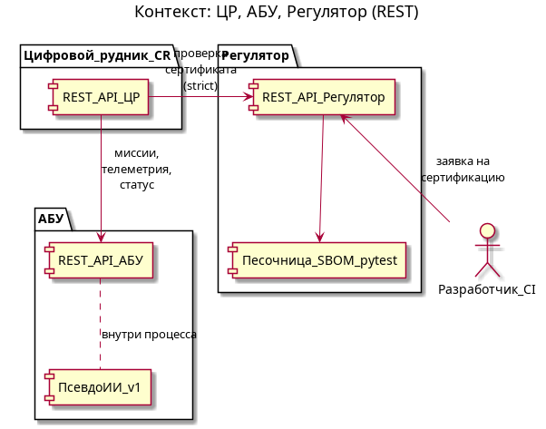
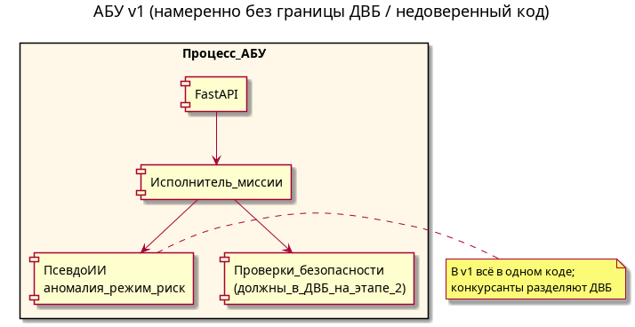

# Архитектура прототипа: ЦР, АБУ, Регулятор

## Контекст

Цифровой рудник (ЦР) координирует выдачу заданий и сбор телеметрии с автономных буровых установок (АБУ). Регулятор выполняет процедуру сертификации поставки ПО АБУ и выдаёт результат и «сертификат» (в прототипе — хэш сертификационного пакета). Взаимодействие — по **REST API**.

## Цифровой рудник (ЦР)

Расположение кода: `external_systems/digital_mine/`.

- Регистрация установок (`rig_id`, базовый URL API АБУ, опционально `certificate_id`).
- Политика **`CR_CERT_POLICY`**: `strict` — миссии только при действительном сертификате (проверка через Регулятор); `permissive` — допускается работа без сертификата с предупреждением.
- Проксирование создания миссий к API АБУ.

## АБУ (стартовая версия)

Расположение: `src_starting_point/`.

- Исполнение миссий, упрощённая телеметрия, локальные ограничения.
- **Псевдо-ИИ** (простые эвристики): оценка аномалии вибрации, подсказка режима бурения, флаг риска — в v1 **не отделены** от остального кода и не вынесены в отдельную недоверенную зону; это **технический долг** для конкурсантов.
- На **этапе 2** жёсткие проверки безопасности (лимиты, аварийный стоп) должны быть перенесены в доверенную вычислительную базу (ДВБ).

## Регулятор

Расположение: `external_systems/regulator/`.

- Пример SBOM для проверок: [examples/abu_sbom.cdx.json](examples/abu_sbom.cdx.json).
- Приём заявки на сертификацию (путь к архиву пакета, SBOM).
- Песочница: виртуальное окружение, `pytest` с покрытием по коду АБУ.
- Оценка стоимости — **полиномиальная** функция от размера и сложности ДВБ (число компонентов SBOM и др.).
- **`certificate_id`** = **SHA-256** файла архива сертификационного пакета (см. [certification_process.md](certification_process.md)).

## Псевдо-ИИ и перенос в ДВБ (этап 2)

| Модуль | Назначение | Выход |
|--------|------------|--------|
| `anomaly_vibration` | отклонение вибрации от скользящего среднего | score 0…1 |
| `regime_suggest` | эвристика режима по глубине и моменту | обороты, подача |
| `risk_flag` | пороги по сенсорам | low / medium / high |

**Проверки, которые на этапе 2 следует вынести в ДВБ:** верхние пределы оборотов и глубины; запрет работы при `risk=high`; аварийный стоп при аномальной вибрации. В v1 они вызываются в том же процессе, что и псевдо-ИИ.

## Правило ДВБ по умолчанию

Без явного перечисления компонентов ДВБ в манифесте **весь код поставки** в пакете считается ДВБ при расчёте покрытия и стоимости.

## Сценарий миссии (диаграмма последовательности)

## Пайплайн сертификации

## REST (верхний уровень)

| Система    | Примеры эндпоинтов |
|-----------|---------------------|
| АБУ       | `GET /api/v1/health`, `POST /api/v1/missions`, `GET /api/v1/status` |
| ЦР        | `POST /api/v1/rigs`, `POST /api/v1/missions`, `GET /api/v1/health`, `GET /api/v1/security/context`, `GET /api/v1/rigs` |
| Регулятор | `POST /api/v1/certification/requests`, `GET /api/v1/certificates/{id}`, `GET /api/v1/certificates/{id}/sga` |

Подробнее процесс сертификации: [certification_process.md](certification_process.md).

## TARA и тесты безопасности

- Упрощённый разбор угроз для АБУ: [tara_abu.md](tara_abu.md), диаграмма пути атаки (numpy → критичные команды): `diagrams/tara_attack_numpy.puml` → `diagrams/png/tara_attack_numpy.png` после `make diagrams`.
- Сопоставление целей (SG) и тестов: [security_tests.md](security_tests.md).

## Ссылки и примеры (изоляция и монитор)

Для проектирования **изоляции доменов** и **контроля взаимодействий** (см. критерии C21–C22 в [contest_regulations.md](contest_regulations.md)) можно ориентироваться на учебный пример (не входит в поставку прототипа):

- Репозиторий: [cyberimmune-systems-example-traffic-light-jupyter-notebook](https://github.com/cyberimmunity-edu/cyberimmune-systems-example-traffic-light-jupyter-notebook)
- Ноутбук: [cyberimmunity-traffic-lights-example.ipynb](https://github.com/cyberimmunity-edu/cyberimmune-systems-example-traffic-light-jupyter-notebook/blob/master/cyberimmunity-traffic-lights-example.ipynb)
